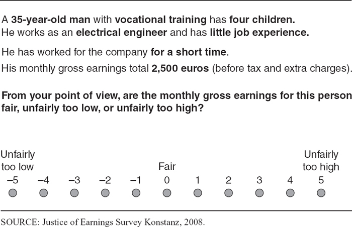
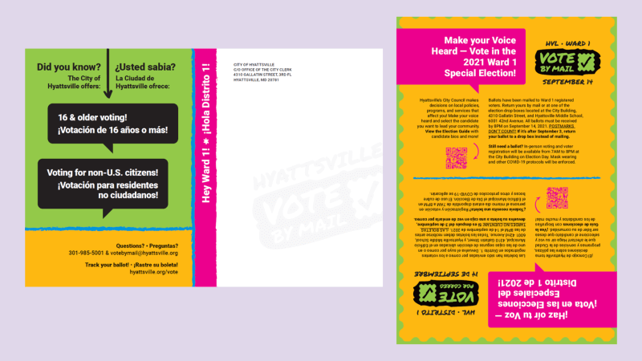

## Agenda and Recap

- Recap Midterm next Monday and release answers on Canvas later this week
- Today: Scientific method, cause and effect, and experiments

## Question

Which of the following is not a required element of an experiment?

- Control Group
- Manipulation (treatment)
- Random Assignment
- A laboratory setting

## Recap of scientific method, cause and effect

- Cause and effect

- What is science?

- Scientific method

## Recap of scientific method, cause and effect

- Cause and effect

        - What is a cause?

- What is science?

- Scientific method

## Recap of scientific method, cause and effect

- Cause and effect

        - What is a cause?
        - what is the general problem with finding true causes?

- What is science?

- Scientific method

## Recap of scientific method, cause and effect

- Cause and effect

        - What is a cause?
        - what is the general problem with finding true causes?
        - What is the fundamental problem of causal inference? (Put differently: What is the hardest obstacle to determining true causes?)

## Recap of scientific method, cause and effect

- Cause and effect

        - What is a cause?
        - what is the general problem with finding true causes?
        - What is the fundamental problem of causal inference? (Put differently: What is the main problem in determining true causes?)
        - What is the problem in determining causes that statistical methods address?

- What is science?

- Scientific method

## Recap of scientific method, cause and effect

- Cause and effect: Three sets of problems

        - General problem - causes are complicated
        - Fundamental problem - we can't observe the "what if" scenario directly (the counterfactual)
        - There is a random element to the world (statistical problem)

- What is science?

- Scientific method

## Recap of scientific method, cause and effect

- Cause and effect
- What is science?

        - Based on proof or evidence - concerns the world as it actually exists

- Scientific method

## Recap of scientific method, cause and effect

- Cause and effect
- What is science?

        - Based on proof or evidence
        - About cause and effect - again the concern is with how the world actually works

- Scientific method

## Recap of scientific method, cause and effect

- Cause and effect
- What is science?

        - Based on proof or evidence
        - About cause and effect
        - Scientific method involving falsifiable hypotheses

- Scientific method

## Recap of scientific method, cause and effect

- Cause and effect
- What is science?

- Scientific method

**The steps in the scientific method parallel the order of the sections in a research paper. **

## Recap of scientific method, cause and effect

- Cause and effect
- What is science?

- Scientific method

**The steps in the scientific method parallel the order of the sections in a research paper. **

**What is step 1?**

## Recap of scientific method, cause and effect

- Cause and effect

        
- What is science?

- Scientific method

        1.  Define a *research question*

## Recap of scientific method, cause and effect

- Cause and effect

        
- What is science?

- Scientific method

        1.  Define a *research question*

**In a paper we look two places. First, we review the current literature for answers to the question. Then we move to the next step a new theory and...**

**The theory section includes what? (Step Two)**

## Recap of scientific method, cause and effect

- Cause and effect

        
- What is science?

- Scientific method

        1.  Define a *research question*
        2.  Make predictions - *hypothesis*

**Once we have predictions, we need to do two things to test them. What is step 3?**        

## Recap of scientific method, cause and effect

- Cause and effect

        
- What is science?

- Scientific method

        1.  Define a *research question*
        2.  Make predictions - *hypothesis*
        3.  Gather *data*
        
## Recap of scientific method, cause and effect

- Cause and effect

        
- What is science?

- Scientific method

        1.  Define a *research question*
        2.  Make predictions - *hypothesis*
        3.  Gather *data*

**After we have data, what do we do with it?**

## Recap of scientific method, cause and effect

- Cause and effect

        
- What is science?

- Scientific method

        1.  Define a *research question*
        2.  Make predictions - *hypothesis*
        3.  Gather *data*
        4.  Analyze the data to *test* the hypothesis
        
**After testing the hypotheses, what do we do?**

## Recap of scientific method, cause and effect

- Cause and effect

        
- What is science?

- Scientific method

        1.  Define a *research question*
        2.  Make predictions - *hypothesis*
        3.  Gather *data*
        4.  Analyze the data to *test* the hypothesis
        5.  Draw conclusions
        
**Is drawing conclusions the end of the scientific process?**

## Recap of scientific method, cause and effect

- Cause and effect

        - What is a cause?
        - what is the general problem with finding true causes?
        - What is the fundamental problem of causal inference? (Put differently: What is the main problem in determining true causes?)
        - What is the problem in determining causes that statistical methods address?
        
- What is science?

        - Based on proof or evidence
        - About cause and effect
        - Scientific method involving falsifiable hypotheses

- Scientific method

        1.  Define a *research question*
        2.  Make predictions - *hypothesis*
        3.  Gather *data*
        4.  Analyze the data to *test* the hypothesis
        5.  Draw conclusions - Start again at step 1

# Experiments

## Excellent resource - highly recommended to read on your own

[Experiments Chapter 7 from Empirical Methods in Political Science](https://nulib-oer.github.io/empirical-methods-polisci/experiments.html)

Reading this will be of great use to you in understanding the topic for testing, future discussion in this class, and your own knowledge

## Overview

- Why do we do experiments?
- What is an experiment?
- What are the types of experiment?
- What makes a good experiment?

## Why do we do experiments?

- In the real world, we can't observe the counterfactual or "what if" scenario. We can't observe what would have happened if we had done something different.

## Why do we do experiments?

In an experiment, we do it differently. We create the counterfactual. We create the "what if" scenario and the factual scenario and compare them. 

## Why do we do experiments?

How can we devise a way to create and compare the factual and counterfactual scenarios reliably?

## What is an experiment?

Experiments are also known as *randomized controlled trials* (RCTs) or *controlled studies*. 

## What is an experiment?

The name "randomized controlled trial" tells us a lot about what an experiment is.

## What is an experiment?

- Controlled

        - The researcher controls the manipulation (treatment or intervention)
        - The subjects (people in the trial) are divided into control group and a treatment group
        
## What is manipulation?

- The manipulation is the treatment or intervention that the researcher applies to the treatment group
- In a clinical trial this might be a new drug or a new therapy
- In one of the first political field experiments, the manipulation was a mail get-out-the-vote campaign
- The treatment group gets the manipulation, the control group does not
        
## Why do we split into two groups?

- The control group is the counterfactual scenario, the "what if" scenario
- The treatment group is the factual scenario that receives the manipulation (treatment or intervention)
- We compare the two groups to see if the manipulation had an effect
- The control group allows us to see what would have happened if we had not done the manipulation, for example if we had not sent out the get-out-the-vote campaign in the mail

        
## What is an experiment?

Randomized

- The subjects are randomly assigned to the control group or the treatment group
- Random selection, which we will discuss in non-experimental studies, is different from random assignment and not as important in experiments
        
## Why do we randomize?

- Randomization allows us to compare the groups more reliably
- Randomization in a large enough sample allows us to assume that the groups are similar in all ways except for the manipulation
- Randomization should assure that any *confounding variables* are distributed equally between the groups
        
## What is an experiment?

An experiment has three vital components:

- Manipulation (treatment or intervention)
- Random assignment
- Control group

## What are the types of experiment?

- Lab experiments
- Survey experiments
- Field experiments

## What are the types of experiment?

Lab experiments

- In a lab (controlled environment)
- High internal validity
- Low external validity

## What are the types of experiment?

Survey experiments

- In a survey
- The treatment group is shown a *vignette* before answering the survey
- Vignette may be a photo, video, or text
- Many vignettes have subjects read a mock news story about an issue
- Control vignette that omits the treatment

## Vignette example

## Vignette example

From the previous example, what are some things we could "leave out" of the control vignette to study a particular treatement effect?

## What are the types of experiment?

Field experiments

- In the real world
- Less concern about psychological effects of setting
- May be more generalizable

## Field experiment examples

^[https://civic.umd.edu/news/hyattsville-and-umd-conduct-first-nation-experiment-mobilizing-voters-under-18]

## Field experiment examples

In a Get Out the Vote (GOTV) experiment, a typical design would:

- pick multiple voting precincts in the same election
- randomly assign some to receive a mailer and some not in each precinct
- select precincts to match the population of interest

## What makes a good experiment?

- Internal validity
- External validity

## What makes a good experiment?

Internal validity: Unbiased (not influenced by the researcher other than the manipulation) 

        - Design
        - Content
        - Analysis
        
Effective randomization is a major portion of internal validity

## What makes a good experiment?

External validity: Generalizability

        - To what populations can we generalize the results?
        - To what settings can we generalize the results?
        - To what times can we generalize the results?
        
Sample selection is a major portion of external validity

## What can improve external validity?

- Field experiments (natural setting)
- Large, diverse samples
- Inclusion and exclusion criteria 
- Replication (repeating with different samples)
- Psychological realism ("cover story")
- Statistical methods

## Authorship, License, Credits

- Author: Tom Hanna

- Website: <a href="https://tom-hanna.org/">tomhanna.me</a>

- Do not submit to Chegg or similar websites

- License: This work is licensed under a <a href= "http://creativecommons.org/licenses/by-nc-sa/4.0/">Creative Commons Attribution-NonCommercial-ShareAlike 4.0 International License.</>

