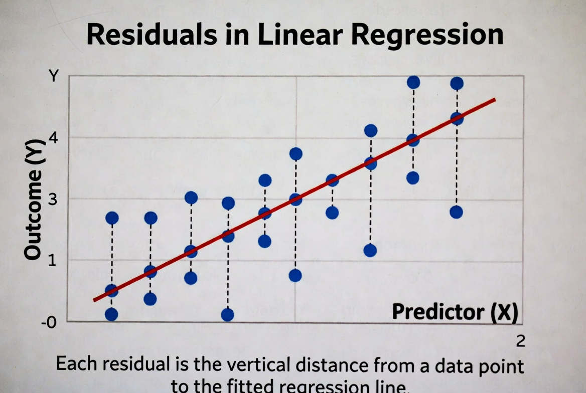

# Agenda and recap

## Today

- What a regression line (OLS) does, in pictures
- How the line becomes a prediction formula
- How to read a simple journal-article regression table
- How to turn coefficients into a prediction for a change in \(X\)
- Brief: what if the model is not OLS? (logit, probit, etc.)

## Where we are in the course

- We have talked about variables, distributions, and relationships.
- We have seen scatterplots and talked about “positive” and “negative” relationships.
- Today we move from describing a relationship to writing *a specific line* that summarizes it.

# What OLS is doing (no heavy math)

## A cloud of points and a line

- Imagine a scatterplot of \(X\) (e.g., income) and \(Y\) (e.g., turnout).
- Many lines could be drawn, but some will “fit” the points better than others.
- Ordinary Least Squares picks **one** line as “best.”

## “Best” in the OLS sense

- For each point, the *residual* is “actual \(Y\) minus predicted \(Y\).”
- OLS chooses the line that makes the *squared residuals* as small as possible overall.
- Visually: the chosen line keeps the vertical distances from the points to the line as small as possible *on average*.

## Video example

Show the video example here

## Visual example (graphic)

{fig-alt="Scatterplot with a regression line and vertical distances from points to the line"} 

# Turning the line into a formula

## The basic regression equation

- The line can be written as a formula:  
  \[
  \hat{Y} = a + bX
  \]
- \(a\) is the **intercept** (predicted \(Y\) when \(X = 0\)).
- \(b\) is the **slope** (how much we expect \(Y\) to change when \(X\) increases by 1 unit).

## Interpreting the slope

- If \(b = 2\), then when \(X\) increases by 1 unit, predicted \(Y\) increases by 2 units.
- If \(b = -0.5\), a 1-unit increase in \(X\) is associated with a 0.5-unit *decrease* in predicted \(Y\).
- The slope is the “effect” of \(X\) on \(Y\) in this simple model.

## Example with a story

- Suppose \(Y =\) political knowledge score (0–10) and \(X =\) years of education.
- If the estimated line is \(\hat{Y} = 2 + 0.3X\), then:
  - A person with 10 years of education has predicted knowledge \(= 2 + 0.3(10) = 5\).
  - A person with 14 years of education has predicted knowledge \(= 2 + 0.3(14) = 6.2\).
- Going from 10 to 14 years (a 4‑year increase) raises predicted knowledge by \(0.3 \times 4 = 1.2\) points.

# Reading a simple regression table

## What a one-variable regression table looks like

In a journal article, a very simple OLS table for one \(X\) might look like this:

| Variable          | Coefficient | Std. Error |
|-------------------|------------:|-----------:|
| Education (years) |       0.30  |      0.05  |
| Constant          |       2.00  |      0.40  |

- “Coefficient” is the estimate of \(b\) (for Education) or \(a\) (for the Constant).
- “Std. Error” is a measure of uncertainty, but today we focus on using the **coefficients** for predictions.

## Turning the table into the formula

- From the table, the **intercept** is 2.00.
- The **slope** for Education is 0.30.
- So the regression line is:
  \[
  \hat{Y} = 2.00 + 0.30 \times \text{Education}
  \]

## Using the formula for prediction

- If a person has 12 years of education:
  - \(\hat{Y} = 2.00 + 0.30(12) = 5.6\).
- If a person has 16 years of education:
  - \(\hat{Y} = 2.00 + 0.30(16) = 6.8\).
- The model gives a *predicted* knowledge score for any value of education.

# From change in X to change in Y

## The key idea

- In a simple line \(\hat{Y} = a + bX\), the slope \(b\) tells us the change in predicted \(Y\) for a 1‑unit change in \(X\).
- For a bigger change in \(X\), multiply \(b\) by the size of that change.
- This is often what authors mean by “substantive effect.”

## Step-by-step method students should use

1. Read the coefficient for the variable \(X\) of interest (this is \(b\)).
2. Decide on a realistic change in \(X\) (for example, 4 extra years of education).
3. Multiply the coefficient by that change in \(X\).
4. Interpret the result as the predicted change in \(Y\).

## Worked example

Using the table above:

- Coefficient on Education: \(b = 0.30\).
- Consider a change in Education from 10 to 14 years (\(\Delta X = 4\)).
- Predicted change in \(Y\) is:
  \[
  \Delta \hat{Y} = b \times \Delta X = 0.30 \times 4 = 1.2
  \]
- Interpretation: increasing education from 10 to 14 years is associated with a 1.2‑point increase in predicted knowledge.

## Another example with a different outcome

- Suppose an article has \(Y =\) turnout percentage in a district and \(X =\) campaign spending (in thousands of dollars).
- If the coefficient is \(b = 0.8\), then:
  - A \$10,000 increase in spending (\(\Delta X = 10\)) leads to a predicted turnout change of \(0.8 \times 10 = 8\) percentage points.
- Students can always ask: “For a realistic change in \(X\), how big is the predicted change in \(Y\)?”

# Very brief: other models in articles

## Why you might see models that are not OLS

- Some outcomes are not continuous numbers (e.g., yes/no, counts, ordered categories).
- Authors use other models that fit the outcome type better.
- Common ones in political science:
  - Logistic regression (logit)
  - Probit
  - Count models (Poisson, negative binomial)
  - Ordered logit/probit

## What stays the same conceptually

- There is still an equation linking \(X\) to a prediction for \(Y\).
- The model still has **coefficients** that describe how changes in \(X\) affect the prediction.
- We can still think in terms of:
  - Coefficient \(\rightarrow\) effect of one-unit change in \(X\).
  - Bigger change in \(X\) \(\rightarrow\) coefficient times that change.

## What changes compared to OLS

- In OLS, the line is directly in the units of \(Y\).
- In logit/probit, the equation predicts something like a *transformed* version of the probability (not raw \(Y\) itself).
- Authors often help by converting results into:
  - Predicted probabilities for particular values of \(X\).
  - “Marginal effects” that say “a one-unit change in \(X\) changes the probability of \(Y=1\) by so many percentage points.”

## How students can read these models at this level

- Focus on the **direction**: is the coefficient positive or negative?
- Focus on whether authors say the effect is “large,” “small,” or “not statistically significant.”
- When authors provide predicted probabilities or marginal effects, read those the same way you did for OLS:
  - For a change in \(X\), how much does the predicted probability change?

# Wrap-up and practice

## Key takeaways

- OLS chooses a single regression line to summarize the relationship between \(X\) and \(Y\).
- The line becomes a simple formula: \(\hat{Y} = a + bX\).
- Given the coefficient \(b\), a change in \(X\) of size \(\Delta X\) leads to a predicted change in \(Y\) of \(b \times \Delta X\).
- Other models in articles still link \(X\) to a prediction; you can read direction and size of effects even without the math.

## Practice Table

| Variable           | Coefficient | Std. Error |
|--------------------|------------:|-----------:|
| Political interest |        1.50 |       0.30 |
| Constant           |       20.00 |       2.00 |

Y political knowledge index on a 0–10 scale, X political interest on a 1–5 scale.

## Practice questions

1. Write the regression line formula based on the table.
2. Write the effect in a sentence: “A one-unit increase in political interest is associated with a ___-point increase in the predicted political knowledge index.”
3. What is the predicted $Y$, political knowledge index, for someone with a political interest score of 3?
4. If political interest increases from 2 to 4, what is the predicted change in the political knowledge index?

