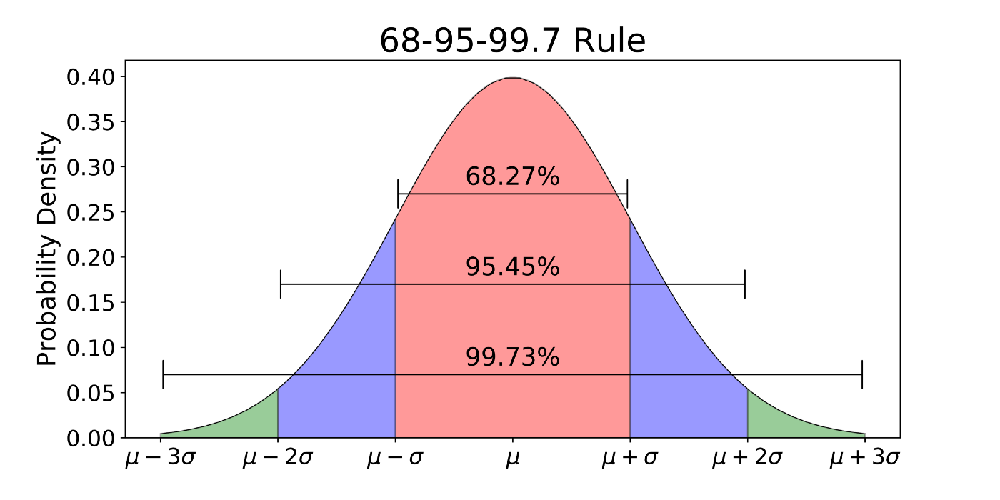

        
# Agenda and Announcements
        
- Today
        
        - Hypothesis Testing and Confidence Intervals
        - Top Hat Quiz

- Next Class
        
        - Article Discussion: Shirani-Mehr, Houshmand, David Rothschild, Sharad Goel, and Andrew Gelman. 2018. “Disentangling bias and variance in election polls.” Journal of the American Statistical Association 113(522): 607–614.        


        
        
        
        
# Hypothesis testing 
        
## What is a hypothesis
        
- A falsifiable statement about what we believe will happen based on the theory we are trying to test.


## Falsifiable:


- We start from the assumption that our theory is wrong
- Our hypothesis is called the 

**alternative hypothesis** or **H1**
        
- because it is the alternative to our assumption of no relationship

**null hypothesis** or **H0**
        
        
## Testing the null hypothesis
        
- Statistical tests show the degree of certainty that we can reject the null hypothesis
- They show the probability that the alternative hypothesis is due to random chance
- When the probability, *p*, is below our pre-determined threshold, we reject the null hypothesis 
- **If we reject the null hypothesis, the alternative hypothesis is true, right?**
        
        
## NO!
        
- **If we reject the null hypothesis, the alternative hypothesis is true, right?**
        
        
**NO!!!!**
        
        
- If we reject the null, we infer that the alternative hypothesis (our hypothesis) is approximately true within the probability we have chosen. 
- If we reject the null, we can say there is strong evidence that the alternative hypothesis (our hypothesis) is true
- We often test multiple hypotheses


## How do we get to testing the null?

**How do we get from a sample with a correlation to talking about testing a hypothesis for a population?**
        
        
- Tying sample statistics to population parameters (LLN)
- Probability distributions
- Tying our data to the probability distributions (CLT)


## Statistics to parameters

- We rely on the Law of Large Numbers and use sample statistics
- With sufficient sample size and proper math, our sample mean is an unbiased estimator of the population mean
- With CLT, $s^2$ is an unbiased and consistent estimator of $\sigma^2$
        - For the normal distribution $s^2$ is also the Minimum Variance Unbiased Estimator for $\sigma^2$
        
        
## Probability distributions
        
The *68-95-99.7 Rule*
        
+ Allows us to estimate probability based on distance from the mean
+ Applies to normal distribution
+ Basis for the actual decision rules


## The 68-95-99.7 Rule




## From Distribution to Confidence

- We can now bridge the gap between probability distributions and our sample data. 

- CLT ties our sample means to the normal distribution

- Sample stats are unbiased estimators of population parameters

- They are only *point estimates*, so we construct a *confidence interval*
        
        - *confidence interval* a range of values around the *point estimate* that we are X% confident contains the true population parameter

## Math and philosophy of the confidence interval

- Math and philosophy detail: The true population parameter is a fixed but unknown number, while our calculated interval is random but known with certainty. Our X percent confidence reflects the long-run reliability of our method. If we repeated this exact sampling process 100 times, X of the resulting intervals would successfully capture the true population parameter.

---
        
## Calculating the Interval
        
- we need three pieces of information:
        
- point estimate = sample statistics
- standard error = the standard deviation of the sampling distribution
- critical value derived from our desired confidence level - for normal distribution this is a z-score
- For 95% confidence, the critical z is 1.96

## Confidence Interval of the Mean


- The general formula for a confidence interval of the mean is:
        
$$CI = \bar{x} \pm z \left( \frac{s}{\sqrt{n}} \right)$$     


## Confidence Interval of the variance

- More complicated formula 
        
$$\frac{(n-1)s^2}{\chi^2_{\alpha/2}} \le \sigma^2 \le \frac{(n-1)s^2}{\chi^2_{1-\alpha/2}}$$
- Because we have to use the Chi Square, $\chi^2$ , distribution        
- We will discuss $\chi^2$ more in hypothesis testing
        

## CI of the standard deviation

$$\sqrt{\frac{(n-1)s^2}{\chi^2_{\alpha/2}}} \le \sigma \le \sqrt{\frac{(n-1)s^2}{\chi^2_{1-\alpha/2}}}$$
- Also uses the $\chi^2$ distribution


## Why the $\chi^2$ not the normal?

- What did we do the deviations from the mean, ($x_i - \bar{x}$) to compute variance? 

- When we square distances from the mean to get the variance, the distribution changes
- By eliminating all negative numbers, the distribution becomes skewed and looks like this:


        
## Distribution Comparison
        
```{r}
#| eval: true
#| echo: false
#| warning: false
#| message: false
#| fig-align: "center"

library(ggplot2)

ggplot(data.frame(x = c(-4, 15)), aes(x = x)) +
        stat_function(fun = dnorm, args = list(mean = 0, sd = 1), aes(color = "Standard Normal"), linewidth = 1) +
        stat_function(fun = dchisq, args = list(df = 3), aes(color = "Chi-Square (df=3)"), linewidth = 1) +
        stat_function(fun = dchisq, args = list(df = 5), aes(color = "Chi-Square (df=5)"), linewidth = 1) +
        scale_color_manual(name = "Distributions", 
                           values = c("Standard Normal" = "black", 
                                      "Chi-Square (df=3)" = "blue", 
                                      "Chi-Square (df=5)" = "red")) +
        labs(title = "Normal vs Chi-Square",
             x = "Value", 
             y = "Density") +
        theme_minimal()
```


## Authorship, License, Credits

- [Stephen Moore](https://rpubs.com/stephenmoore56/301283) code used to simulate the Law of Large Numbers

- 68-95-99 rule graphic [Source:https://towardsdatascience.com/understanding-the-68-95-99-7-rule-for-a-normal-distribution-b7b7cbf760c2](https://towardsdatascience.com/understanding-the-68-95-99-7-rule-for-a-normal-distribution-b7b7cbf760c2)

- Author: Tom Hanna

- Website: <a href="https://tom-hanna.org/">tomhanna.me</a>
        
        - License: This work is licensed under a <a href= "http://creativecommons.org/licenses/by-nc-sa/4.0/">Creative Commons Attribution-NonCommercial-ShareAlike 4.0 International License.</>
        
        <a href= "http://creativecommons.org/licenses/by-nc-sa/4.0/"></a>
        
        